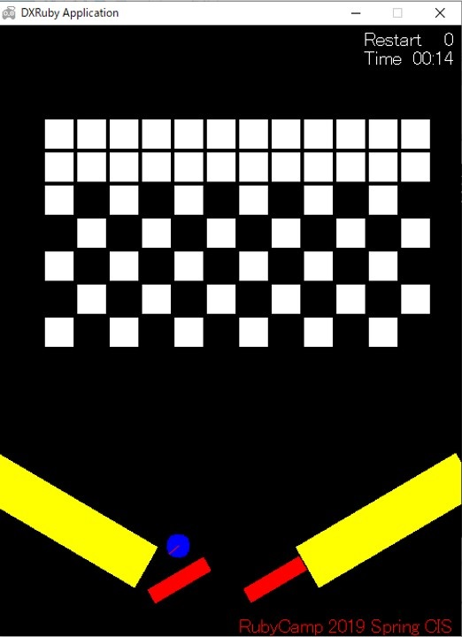
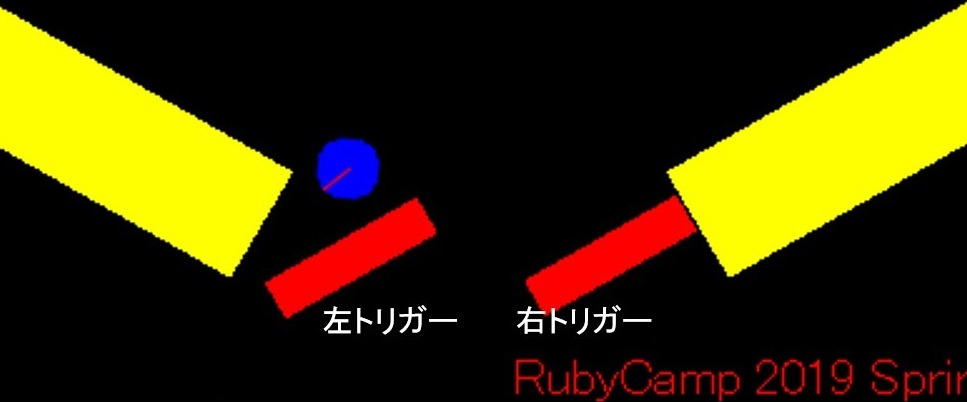

# rc2019sp_g2

Coded by  
RubyCamp2019Spring Group2 : CIS  

## このゲームについて

ピンボールとブロック崩しの合いの子です。  

## ゲームのルール

1. トリガーでボールをはじく
1. ボールに当たったブロックは消える
1. ボールを落とさずにブロックを全て消したらGAME CLEAR！
1. ボールを落としてもリトライできます

## プレイ中の操作方法

- キーボード【←】：左トリガーが回転  
- キーボード【→】：右トリガーが回転  

## このゲームの魅力

- 超シンプル
- 爽快感がある！  
→ ありそうで無かった新感覚
- リスタート機能  
→ ちょうどいい難易度
- **謎のＢＧＭの壮大感（笑）**
- やりこみ要素あり  
→ STAGE 1 ～ 7まであります
- 完全クリアすると…？
